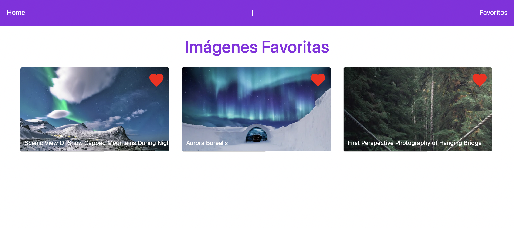

# Desafío - Natural Pic

Descripción:
Natural Pic es una nueva plataforma dedicada a fotógrafos que promueve el interés por el cuidado ambiental y las fotos de paisajes naturales sin filtros. En este desafío estarás trabajando en el sistema de likes usando Context API para el manejo de estado global y React Router para la creación de las vistas Home y Favoritos.
Para este desafío, descarga el material de apoyo en donde encontrarás una aplicación base con React Router que deberás completar, incluyendo lo correspondiente a Context API.

